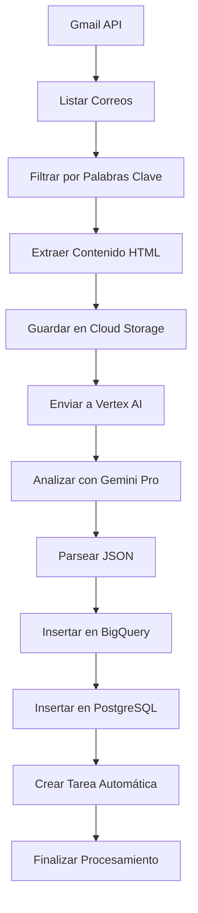

# Sistema de Procesamiento Automático de Correos de Compliance

## 📋 Descripción

Este proyecto implementa un sistema automatizado de **Google Cloud Function** que procesa correos electrónicos relacionados con problemas de compliance en aplicaciones móviles. El sistema:

- 🔍 **Monitorea automáticamente** un buzón de Gmail en busca de correos con palabras clave de compliance
- 🤖 **Analiza el contenido** usando **Vertex AI (Gemini Pro)** para extraer información estructurada
- 💾 **Almacena resultados** en **BigQuery** y **PostgreSQL** para análisis y seguimiento
- 📋 **Crea tareas automáticas** basadas en el análisis para gestión de proyectos
- ☁️ **Guarda copias** de los correos en **Cloud Storage** para auditoría
- 🔐 **Gestiona secretos** de forma segura usando **Google Cloud Secret Manager**

### Casos de Uso Principales
- Rechazos de aplicaciones en App Store/Google Play
- Violaciones de políticas de privacidad
- Problemas de metadata y contenido
- Incumplimientos de guidelines de las tiendas
- Notificaciones de compliance y seguridad

---

## 🏗️ Estructura del Proyecto

```
ComplianceIssues - V.1/
├── src/
│   ├── main.py                    # Función principal de Cloud Function
│   ├── gmail_utils.py            # Utilidades para Gmail API
│   ├── vertex_utils.py           # Integración con Vertex AI
│   ├── postgres_utils.py         # Operaciones con PostgreSQL
│   ├── bigquery_utils.py         # Operaciones con BigQuery
│   ├── config.py                 # Configuración centralizada
│   ├── gmail_oauth.py            # Autenticación OAuth2
│   ├── test_local.py             # Script de pruebas locales
│   └── token.pickle              # Token de autenticación OAuth2
├── credentials_oauth.json        # Credenciales OAuth2 para Gmail
├── credentials_service.json      # Credenciales de Service Account
├── requirements.txt              # Dependencias del proyecto
└── README.md                     # Este archivo
```

---

## 🚀 Instalación y Configuración

### Prerrequisitos
- ✅ Cuenta de **Google Cloud Platform** con permisos para:
  - Cloud Functions
  - Vertex AI
  - BigQuery
  - Cloud Storage
  - CloudSQL (PostgreSQL)
- ✅ Buzón de **Gmail** con acceso delegado
- ✅ **Python 3.8** o superior
- ✅ **PostgreSQL** configurado (CloudSQL recomendado)

### 1. Instalación de Dependencias

```bash
# Navegar al directorio del proyecto
cd "ComplianceIssues - V.1"

# Instalar dependencias
pip install -r requirements.txt
```

### 2. Configuración con Variables de Entorno

El sistema usa variables de entorno locales para la configuración:

Crea un archivo `.env` en el directorio raíz:

```env
# Gmail Configuration
GMAIL_USER=tu-email@gmail.com
OAUTH_CREDENTIALS=credentials_oauth.json

# Google Cloud Platform
GCP_PROJECT=tu-proyecto-gcp
VERTEX_PROJECT_ID=tu-proyecto-gcp
VERTEX_LOCATION=us-central1
VERTEX_ENDPOINT_ID=tu-endpoint-id

# BigQuery
BIGQUERY_TABLE=proyecto.dataset.tabla_compliance

# Cloud Storage
BUCKET_NAME=tu-bucket-storage

# PostgreSQL (CloudSQL)
PG_HOST=tu-host-postgresql
PG_PORT=5432
PG_USER=tu-usuario
PG_PASSWORD=tu-password
PG_DATABASE=tu-base-datos

# Endpoint externo (opcional)
ENDPOINT_URL=https://tu-endpoint.com
```

### 4. Configuración de Credenciales

#### Para Gmail (OAuth2):
1. Descarga `credentials_oauth.json` desde Google Cloud Console
2. Colócalo en el directorio raíz del proyecto
3. Ejecuta el flujo de autenticación OAuth2

#### Para GCP Services (Service Account):
1. Crea una cuenta de servicio con permisos necesarios
2. Descarga el archivo JSON de credenciales
3. Configura la variable `GOOGLE_APPLICATION_CREDENTIALS`

---

## 🔐 Gestión de Secretos con Secret Manager

### Secretos Requeridos

El sistema espera los siguientes secretos en Secret Manager:

| Nombre del Secreto | Descripción | Ejemplo |
|-------------------|-------------|---------|
| `gmail-user` | Email del buzón de Gmail | `compliance@empresa.com` |
| `gmail-oauth-credentials` | Credenciales OAuth2 (JSON) | `{"web": {...}}` |
| `gcp-project` | ID del proyecto GCP | `mi-proyecto-123` |
| `vertex-project-id` | ID del proyecto para Vertex AI | `mi-proyecto-123` |
| `vertex-location` | Región de Vertex AI | `us-central1` |
| `bigquery-table` | Tabla de BigQuery | `proyecto.dataset.tabla` |
| `bucket-name` | Bucket de Cloud Storage | `compliance-storage` |
| `pg-host` | Host de PostgreSQL | `10.0.0.1` |
| `pg-user` | Usuario de PostgreSQL | `compliance_user` |
| `pg-password` | Contraseña de PostgreSQL | `mi_password_segura` |
| `pg-database` | Base de datos PostgreSQL | `compliance_db` |

### Comandos Útiles de Secret Manager

```bash
# Crear un secreto
echo -n "mi_valor_secreto" | gcloud secrets create mi-secreto --data-file=-

# Actualizar un secreto
echo -n "nuevo_valor" | gcloud secrets versions add mi-secreto --data-file=-

# Obtener un secreto
gcloud secrets versions access latest --secret="mi-secreto"

# Listar secretos
gcloud secrets list
```

---

## 🗄️ Configuración de Bases de Datos

### BigQuery
Crea una tabla con el siguiente esquema:

```sql
CREATE TABLE `proyecto.dataset.tabla_compliance` (
  CorreoId STRING,
  FechaProcesamiento TIMESTAMP,
  Estado STRING,
  AppId STRING,
  Version STRING,
  Motivo STRING,
  Clasificacion STRING,
  HowToFixIt STRING,
  PlataformaOrigen STRING,
  CorreoUrl STRING,
  Guideline STRING,
  RejectInformation STRING,
  NotificationDate TIMESTAMP,
  ComplianceDeadline TIMESTAMP,
  StoreLink STRING,
  StoreAccess STRING
);
```

### PostgreSQL
Crea las siguientes tablas:

```sql
-- Tabla de issues de compliance
CREATE TABLE compliance_db."ComplianceIssues" (
  "CorreoId" VARCHAR(255) PRIMARY KEY,
  "FechaProcesamiento" TIMESTAMP,
  "Estado" VARCHAR(100),
  "AppId" VARCHAR(255),
  "Version" VARCHAR(50),
  "Motivo" TEXT,
  "Clasificacion" VARCHAR(100),
  "HowToFixIt" TEXT,
  "PlataformaOrigen" VARCHAR(50),
  "CorreoUrl" TEXT,
  "Guideline" TEXT,
  "RejectInformation" TEXT,
  "NotificationDate" TIMESTAMP,
  "ComplianceDeadline" TIMESTAMP,
  "StoreLink" TEXT,
  "StoreAccess" TEXT
);

-- Tabla de tareas automáticas
CREATE TABLE compliance_db."ComplianceTasks" (
  "Id" SERIAL PRIMARY KEY,
  "CorreoId" VARCHAR(255),
  "TipoTarea" VARCHAR(100),
  "PrioridadId" INTEGER,
  "EstimacionDias" INTEGER,
  "Origen" VARCHAR(50),
  "Objetivo" TEXT,
  "MaterialAdicional" TEXT,
  "EstadoId" INTEGER,
  "FechaCreacion" TIMESTAMP,
  "FechaActualizacion" TIMESTAMP
);
```

---

## 🔧 Despliegue en Google Cloud Functions

### 1. Preparar el Código
```bash
# Asegúrate de que todos los archivos estén en el directorio src/
# Incluye: main.py, gmail_utils.py, vertex_utils.py, etc.
```

### 2. Desplegar la Función
```bash
# Usando gcloud CLI
gcloud functions deploy compliance-processor \
  --runtime python39 \
  --trigger-http \
  --entry-point main \
  --source src/ \
  --allow-unauthenticated
```

### 3. Configurar Variables de Entorno (Solo si no usas Secret Manager)
```bash
gcloud functions deploy compliance-processor \
  --set-env-vars GMAIL_USER=tu-email@gmail.com,GCP_PROJECT=tu-proyecto
```

### 4. Configurar Permisos
Asegúrate de que la función tenga acceso a:
- Gmail API
- Vertex AI
- BigQuery
- Cloud Storage
- CloudSQL
- **Secret Manager** (nuevo)

```bash
# Dar permisos de Secret Manager a la función
gcloud functions deploy compliance-processor \
  --set-env-vars GOOGLE_CLOUD_PROJECT=tu-proyecto
```

---

## 🧪 Pruebas Locales

### Pruebas Básicas
```bash
# Ejecutar el script de prueba
python src/test_local.py
```

### Pruebas Locales
```bash
# Probar configuración local
python src/test_local.py
```

### Script Personalizado
```python
from main import main
from flask import Request
from werkzeug.test import EnvironBuilder

# Simular una petición HTTP
builder = EnvironBuilder(method='POST', data='{}', content_type='application/json')
env = builder.get_environ()
request = Request(env)

# Ejecutar la función
response = main(request)
print(response)
```

---

## 📊 Flujo de Procesamiento



### Palabras Clave Detectadas
- `rejected`, `rejection`
- `compliance issue`, `compliance violation`
- `privacy policy`, `policy violation`
- `metadata issue`, `review failed`
- `data safety`, `data privacy`
- `content violation`, `trademark violation`
- `release failed`, `action required`

---

## 🔍 Campos Analizados por Vertex AI

| Campo | Descripción | Tipo |
|-------|-------------|------|
| `AppId` | Identificador único de la app | String |
| `Version` | Versión específica de la app | String |
| `Motivo` | Resumen del motivo del rechazo | String |
| `Clasificacion` | Categoría del problema | String |
| `HowToFixIt` | Solución técnica específica | String |
| `PlataformaOrigen` | iOS o Android | String |
| `Guideline` | Política incumplida | String |
| `RejectInformation` | Mensaje literal de rechazo | String |
| `NotificationDate` | Fecha de notificación | Timestamp |
| `ComplianceDeadline` | Fecha límite de corrección | Timestamp |
| `StoreLink` | Enlace a la app en la tienda | String |
| `PrioridadId` | Nivel de prioridad (1-4) | Integer |
| `EstimacionDias` | Días estimados para corrección | Integer |

---

## 🛠️ Mantenimiento y Monitoreo

### Logs y Debugging
- Los logs se imprimen en la consola de Cloud Functions
- Revisa los logs para debugging y monitoreo
- Usa Cloud Logging para análisis avanzado

### Monitoreo de Errores
- Verifica conexiones a bases de datos
- Revisa permisos de APIs
- Monitorea cuotas de Vertex AI
- Verifica configuración del archivo .env

### Actualizaciones
- Mantén actualizadas las dependencias
- Revisa cambios en las APIs de Google
- Actualiza las palabras clave según necesidades
- Mantén seguras las credenciales locales

---

## 🔒 Seguridad y Permisos

### Permisos Requeridos
- **Gmail API**: `https://www.googleapis.com/auth/gmail.readonly`
- **Vertex AI**: Permisos de predicción
- **BigQuery**: Permisos de inserción y consulta
- **Cloud Storage**: Permisos de escritura
- **CloudSQL**: Permisos de conexión y escritura
- **Secret Manager**: `roles/secretmanager.secretAccessor`

### Buenas Prácticas
- ✅ **Usa Secret Manager** para todas las credenciales
- ✅ **Service Accounts** con permisos mínimos
- ✅ **Rota las credenciales** regularmente
- ✅ **Monitorea el uso** de APIs
- ✅ **Implementa rate limiting** si es necesario
- ✅ **Audita accesos** a secretos

---

## 📝 Notas Importantes

- ⚠️ **Deduplicación**: El sistema evita procesar correos duplicados
- 📅 **Filtro temporal**: Solo procesa correos de los últimos 30 días
- 🔄 **Procesamiento asíncrono**: Cada correo se procesa independientemente
- 💾 **Backup automático**: Los correos se guardan en Cloud Storage
- 🎯 **Tareas automáticas**: Se crean tareas de seguimiento automáticamente
- 🔐 **Gestión segura**: Todas las credenciales se manejan con Secret Manager

---

## 👨‍💻 Autor

**Luis Guzmán**

---

## 📄 Licencia

Este proyecto es de uso interno para gestión de compliance de aplicaciones móviles. 